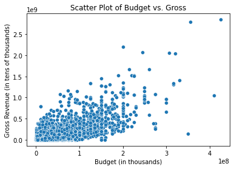
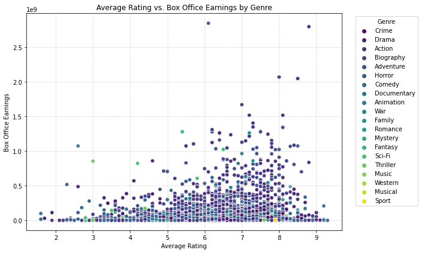
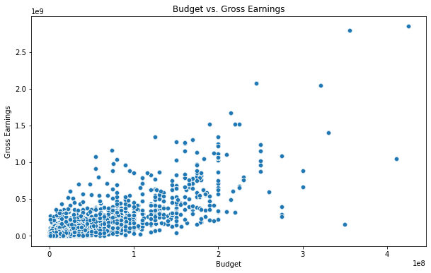
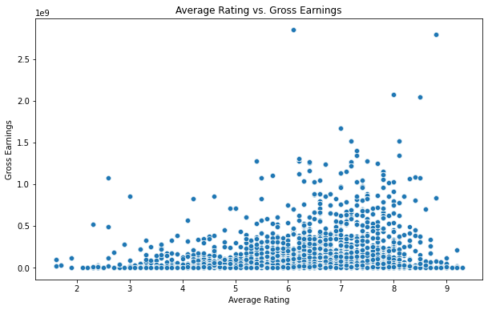
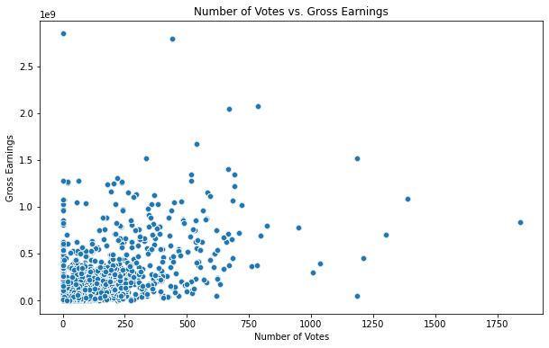
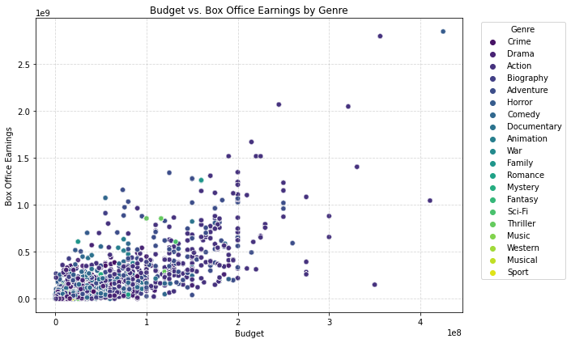
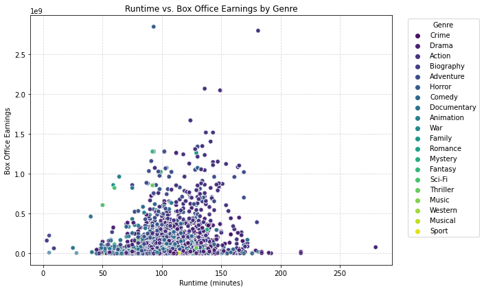

# Microsoft_Film_Analytics
Exploring box office trends to guide Microsoft's new movie studio.
 

## Description
    |Analyzing box office patterns to provide initial guidance for Microsoft's newly established film studio. The primary objective of this endeavor is to assist them in commencing their operations and strategizing for the long term. To achieve this goal, we will leverage data to address two critical inquiries.
####**###

Get the table names contained in the database then columns contained within each. 
## Initial Univariate Analysis.
We will examine the measures of central tendency to introduce the datasets in the following sequence:
* IM.db
* bom_movies
* tm.movie_budgets
* rt.movie_info
* movies
* tmdb.movies
* rt.reviews

Identify and Join only the essential columns into one table and make it a dataframe.

##  Univariate Analysis
Now lets jump onto the rest of the datasets we have and get an understanding of what we're working with.

## Preliminary data cleaning and bivariate analysis

Joining different categories:
* Budgeting and Gross
* Genres and Ratings

### Null Entries
Both tn_movie_budget and bom_movie_gross have similar columns.
However, some rows in different columns are null with some having a place-holder of 0, therefore, the remedy is combining the two sets which  allows fixing of some entries. 
We can then drop the remaining null entries

### Bivariate Analysis.
This analysis allows us to now compare two columns and see the relationship they have.

## Data Cleaning.
### Identify any discrepancies in the data.
So far we have two working combined dataframes.
Join the two combined dataframes into one, drop any null values and then get your new cleaned data.
* imdb_csv
* budget_N_gross
The combined dataframe will help us in a conducting a more indepth bivariate and multivariate analysis.

## Multivariate Analysis
In this section we'll look at the relationship of various columns in reference to one column.

Average Rating vs. Box Office Earnings: Explore the relationship between a movie's average rating and its box office earnings. This can be visualized using a scatter plot.

Budget vs. Earnings: Analyze how a movie's production budget correlates with its box office earnings. Again, scatter plots can be effective for this comparison.

Director's Influence: Investigate whether certain directors have a significant impact on box office success. You can create a heatmap showing the top directors and their movie earnings.

Genre vs. Director: Explore whether specific directors tend to work within particular genres. You can use a stacked bar chart to visualize this.

Runtime vs. Earnings: Analyze how a movie's runtime relates to its box office earnings. A scatter plot can help show this relationship.

Marketing Strategies: Investigate if there's a correlation between marketing budget or strategies and box office earnings. A scatter plot with marketing budget on one axis and earnings on the other can be informative.

## Conclusion 
Based on the results above, Microsoft should focus on Crime, Drama and Action related films moreover, they should carefully select the directors of the movies to increase their chances of producing quality movies that we'll be welcomed by audience.
Lastly, they should always be keen on the budget they set aside for their movie productions, since it has been seen affect the performance of the gross revenue.

## Recommendations
* Leverage Data-Driven Insights: Utilize data analytics to inform content creation, marketing strategies, and investment decisions for improved box office performance.

* Explore Diverse Genres: Diversify film genres to appeal to a broader audience, including documentaries, animation, and international content.

* Collaborate with Industry Experts: Seek partnerships and collaborations with experienced directors, producers, and studios to benefit from their industry knowledge and networks.

* Adapt to Audience Preferences: Continuously analyze consumer feedback and preferences to tailor content and marketing campaigns effectively.

* Integrate Advanced Analytics: Implement advanced analytics techniques, including predictive modeling and machine learning, to forecast box office success and optimize marketing efforts.

* Consider Global Expansion: Evaluate opportunities for international market expansion, taking into account regional preferences and cultural nuances.

* Prioritize Sustainability: Embrace sustainability practices in film production and distribution to align with growing environmental awareness.

* Stay Compliant: Stay updated on industry regulations and compliance standards to ensure smooth operations and ethical practices.

These recommendations are crucial for Microsoft's successful entry and long-term growth in the dynamic film industry.

## Table of Contents

- [Installation](#installation)
- [Usage](#usage)
  - [Usage with Jupyter Notebooks](#usage-with-jupyter-notebooks)
- [Contributing](#contributing)
- [License](#license)

## Installation

To get started with Microsoft_Film_Analytics, follow these steps:

1. Clone the repository: `git clone https://github.com/MarwaBrian/Microsoft_Film_Analytics`
2. Install the required dependencies: `pip install -r requirements.txt`
3. Configure any necessary settings or environment variables.

## Usage

To use Microsoft_Film_Analytics and analyze movie industry data:

1. Load the notebook in jupyter or vscode `./index.ipynb`
2. Follow the prompts and input your preferences.
3. Explore the generated visualizations and insights.

### Usage with Jupyter Notebooks

This project is primarily developed using Jupyter Notebooks, which allows you to interact with the code, visualizations, and data. Follow these steps to get started:

1. **Clone the Repository**: If you haven't already, clone the repository to your local machine:

   open git bash(for windows users) or terminal(for mac or linux users)
   git clone https://github.com/MarwaBrian/Microsoft_Film_Analytics
